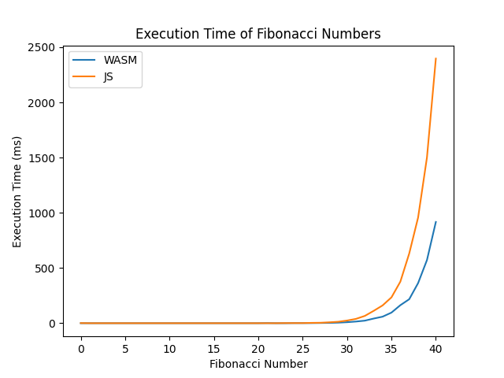

# JavaScript vs WebAssembly Benchmark

This benchmark compares the performance of JavaScript and WebAssembly (Wasm) implementations of a naive recursive Fibonacci algorithm, validating the hypothesis that WebAssembly offers superior performance for client-sided execution.

## Experiment Setup

- **Algorithm**: Both implementations use the naive recursive algorithm based on the standard Fibonacci equation:
  
  $$F(n) = 
  \begin{cases} 
  0 & \text{if } n = 0, \\
  1 & \text{if } n = 1, \\
  F(n-1) + F(n-2) & \text{if } n > 1. 
  \end{cases}$$

- **System Preparation**: Background processes were minimized to ensure that the benchmark could utilize maximum available resources.

- **Hardware Specifications**:
  - CPU: AMD Ryzen 7 5700U
  - RAM: 16GB
  - OS: Windows 11

- **WebAssembly Compilation**: The `.wasm` file was generated from a `.wat` file using WABT's `wat2wasm` tool.

- **Benchmark Environment**:
  - The `index.html` file, containing function calls and benchmarks, was hosted locally using the Visual Studio Code **Live Server** extension to bypass CORS restrictions on fetch requests.
  - Google Chrome (Version 131.0.6778.140) was used for execution.
  - Multiple warm-up runs were performed before recording results to ensure consistency.

## Experiment Results

### Visualization
Below is a graphical representation of the results:

### Key Observations
- WebAssembly significantly outperformed JavaScript in terms of execution time for computing from about the 30th Fibonacci numbers upwards the naive recursive algorithm.
- Details of the performance differences, including statistical analysis, can be found in the accompanying [research paper](example.com).

---

This benchmark provides valuable insights into the efficiency of WebAssembly for computationally intensive tasks compared to JavaScript.

---

### Repository Contents
- **`index.html`**: Contains the setup for the benchmark and the JavaScript fibonacci function.
- **`fibonacci.wat`**: Web Assembly Texformat implementation of the wasm module.
- **`fibonacci.wasm`**: Compiled WebAssembly implementation.
- **`visualization/`**: Folder containing result visualization and python script used to generate it.
- **`README.md`**: Documentation and details about the benchmark.

For more information or to replicate the experiment, refer to the [research paper](example.com).
